# Content Serializer Documentation

## Table of Contents

1. [Overview](#overview)
2. [Architecture](#architecture)
3. [How It Works](#how-it-works)
4. [Component Support](#component-support)
5. [Serialization Process](#serialization-process)
6. [Deserialization Process](#deserialization-process)
7. [Usage Examples](#usage-examples)
8. [Database Integration](#database-integration)
9. [Best Practices](#best-practices)
10. [Troubleshooting](#troubleshooting)

## Overview

The Content Serializer is a powerful utility that converts React components into JSON format for database storage, then reconstructs them back into fully functional React components. It's specifically designed to handle our custom box system, KaTeX math rendering, and complex nested content structures.

### Why We Need This

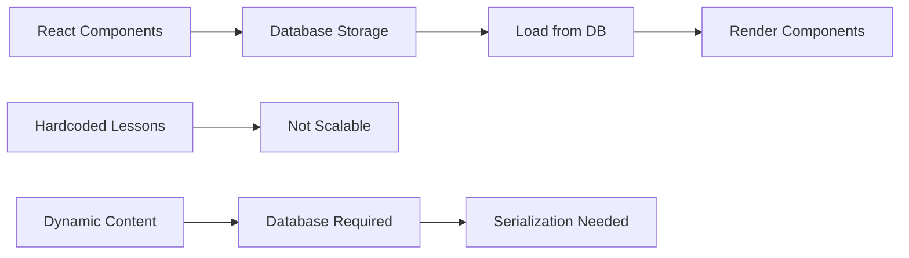

**Problem**: We want to store lesson content in a database for dynamic loading, but React components can't be directly stored as JSON.

**Solution**: Serialize components to JSON → Store in database → Deserialize back to components.

## Architecture

### High-Level Architecture

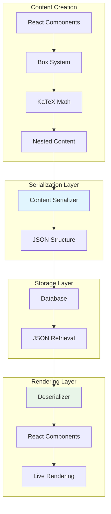

### Component Type Detection

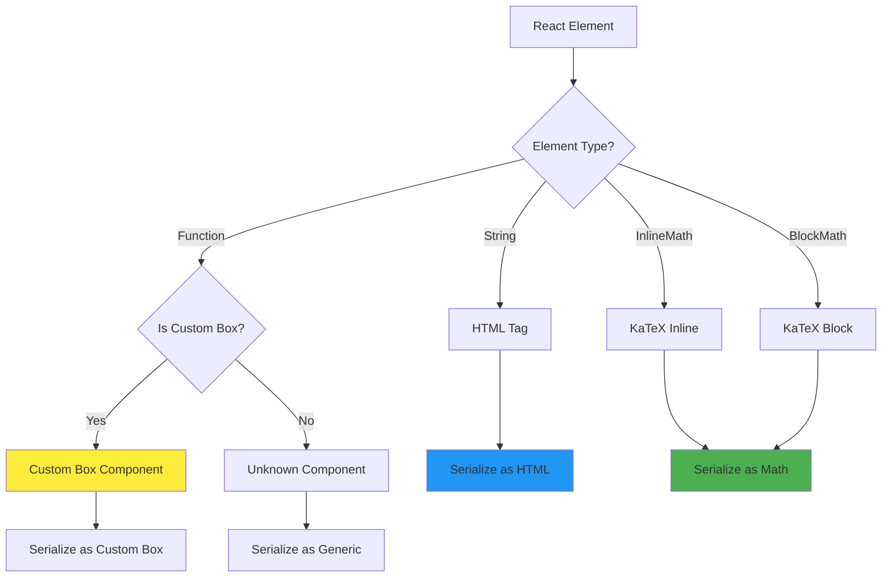

## How It Works

### 1. Component Recognition System

The serializer uses a **Map-based component registry** to identify custom components:

```typescript
// Component Registry
const CUSTOM_COMPONENTS = new Map<React.ComponentType<any>, string>([
  [DefinitionBox, "DefinitionBox"],
  [TipBox, "TipBox"],
  [ExampleBox, "ExampleBox"],
  // ... all 17 box components
]);
```

**Why Map instead of object?**

- Direct component reference comparison (more reliable)
- Works with default exports, arrow functions, etc.
- No dependency on `.name` property

### 2. Serialization Flow

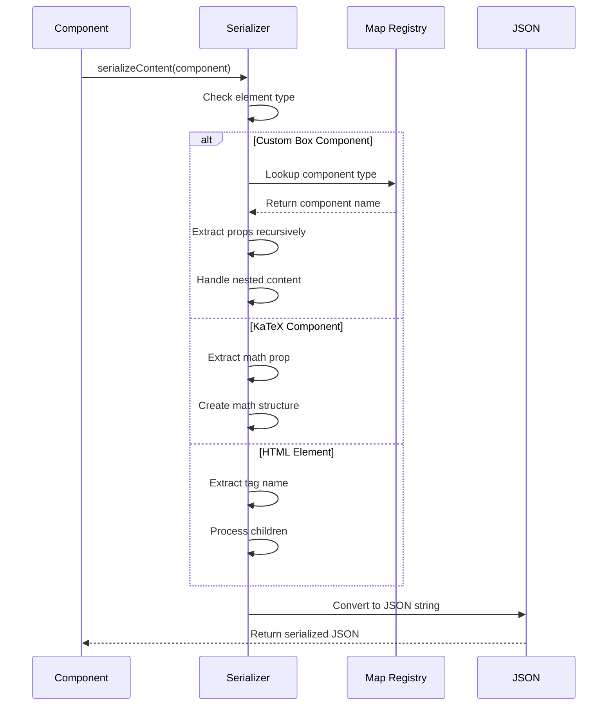

### 3. Deserialization Flow

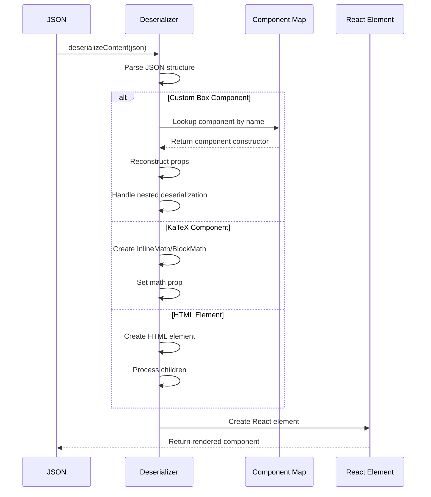

## Component Support

### Supported Component Types

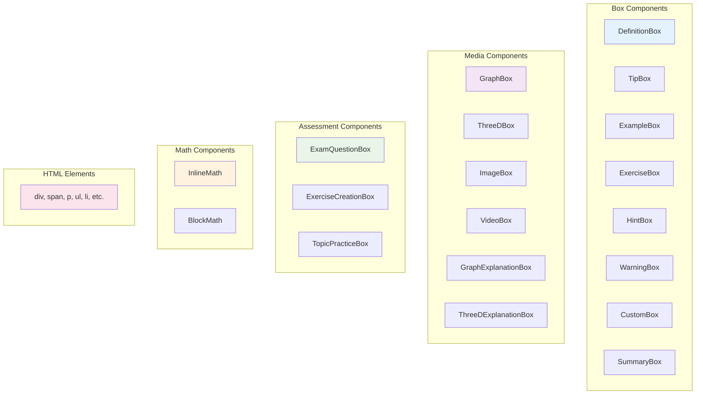

### Component Hierarchy

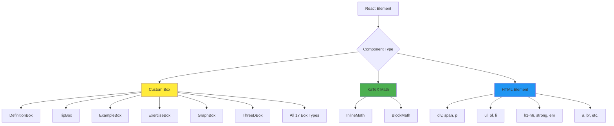

## Serialization Process

### 1. Element Analysis

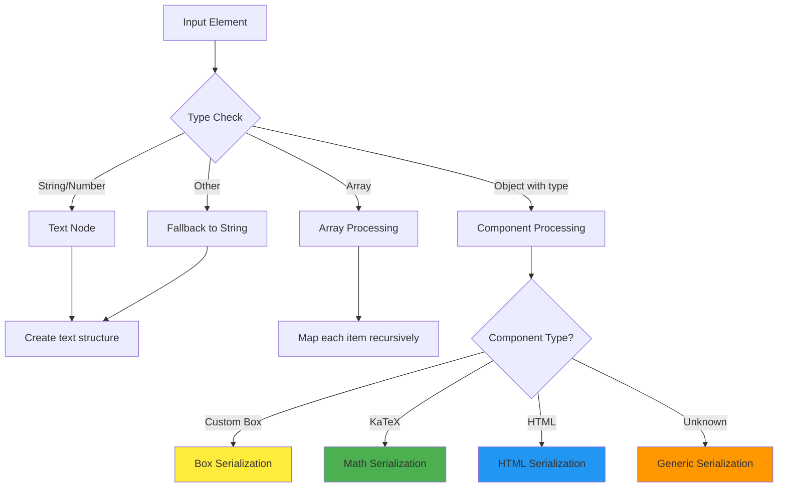

### 2. Custom Box Serialization

```typescript
// Example: TipBox serialization
const tipBox = (
  <TipBox
    title="Important Note"
    content={
      <div>
        Remember that <InlineMath math="i^2 = -1" />
      </div>
    }
  />
);

// Serialized structure:
{
  "type": "TipBox",
  "props": {
    "title": "Important Note",
    "content": {
      "type": "div",
      "props": {
        "children": [
          "Remember that ",
          {
            "type": "InlineMath",
            "props": {
              "math": "i^2 = -1"
            }
          }
        ]
      }
    }
  }
}
```

### 3. Complex Props Handling

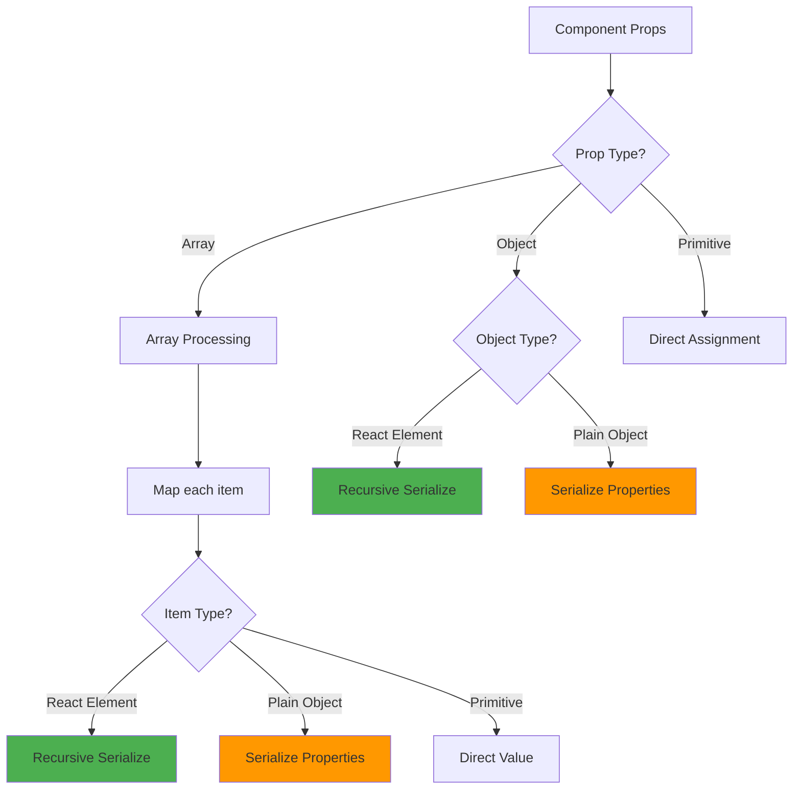

### 4. ExampleBox with Complex Structure

```typescript
// Complex ExampleBox
const example = (
  <ExampleBox
    question={<span>Calculate <InlineMath math="(2+3i) + (1-2i)" /></span>}
    steps={[
      { title: "Add real parts", content: <InlineMath math="2 + 1 = 3" /> },
      { title: "Add imaginary parts", content: <InlineMath math="3i + (-2i) = i" /> }
    ]}
    answer={<InlineMath math="3 + i" />}
  />
);

// Serialized structure:
{
  "type": "ExampleBox",
  "props": {
    "question": {
      "type": "span",
      "props": {
        "children": [
          "Calculate ",
          {
            "type": "InlineMath",
            "props": { "math": "(2+3i) + (1-2i)" }
          }
        ]
      }
    },
    "steps": [
      {
        "title": "Add real parts",
        "content": {
          "type": "InlineMath",
          "props": { "math": "2 + 1 = 3" }
        }
      },
      {
        "title": "Add imaginary parts",
        "content": {
          "type": "InlineMath",
          "props": { "math": "3i + (-2i) = i" }
        }
      }
    ],
    "answer": {
      "type": "InlineMath",
      "props": { "math": "3 + i" }
    }
  }
}
```

## Deserialization Process

### 1. Component Reconstruction

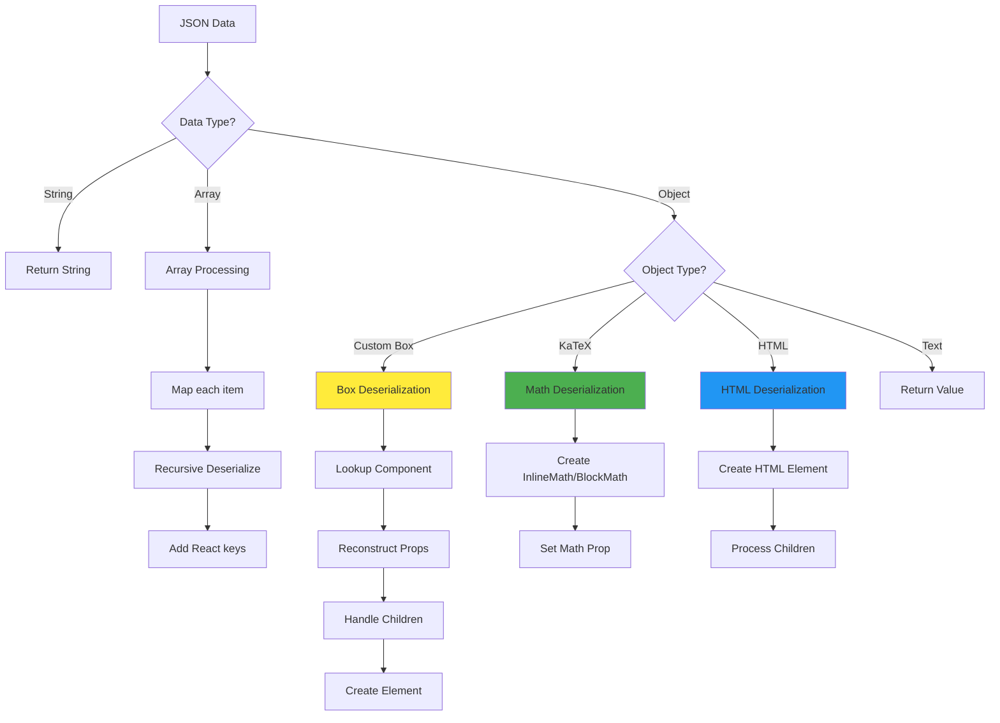

### 2. Component Map Lookup

```typescript
// Component reconstruction map
const componentMap: Record<string, React.ComponentType<any>> = {
  DefinitionBox,
  TipBox,
  ExampleBox,
  ExerciseBox,
  // ... all 17 components
};

// Deserialization logic
if (componentMap[obj.type]) {
  const Component = componentMap[obj.type];
  const { children, ...restProps } = obj.props || {};

  // Recursively deserialize props
  const deserializedProps = deserializeProps(restProps);

  return React.createElement(
    Component,
    { key: Math.random(), ...deserializedProps },
    children ? deserialize(children) : undefined
  );
}
```

### 3. Key Management

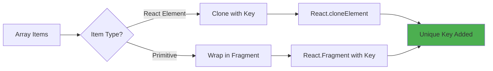

## Usage Examples

### 1. Basic Usage

```typescript
import {
  serializeContent,
  deserializeContent,
} from "@/utils/contentSerializer";

// Create content
const content = (
  <div>
    <DefinitionBox
      title="Complex Numbers"
      content={<InlineMath math="z = a + bi" />}
    />
  </div>
);

// Serialize
const json = serializeContent(content);
console.log(json);
// Output: {"type":"div","props":{"children":[...]}}

// Deserialize
const restored = deserializeContent(json);
// restored is now a fully functional React component
```

### 2. Database Integration

```typescript
// Save to database
async function saveLesson(lessonId: string, content: ReactNode) {
  const json = serializeContent(content);
  await db.lessons.insert({
    id: lessonId,
    title: "Complex Numbers",
    content: json,
    created_at: new Date(),
  });
}

// Load from database
async function loadLesson(lessonId: string) {
  const lesson = await db.lessons.findOne({ id: lessonId });
  if (!lesson) return null;

  const content = deserializeContent(lesson.content);
  return content;
}

// Usage in component
function LessonPage({ lessonId }: { lessonId: string }) {
  const [content, setContent] = useState<ReactNode>(null);

  useEffect(() => {
    loadLesson(lessonId).then(setContent);
  }, [lessonId]);

  return <div>{content}</div>;
}
```

### 3. Complex Lesson Structure

```typescript
const complexLesson = (
  <div>
    <DefinitionBox
      title="Complex Numbers"
      content={
        <div>
          A complex number has the form <InlineMath math="z = a + bi" />
          where <InlineMath math="a, b \in \mathbb{R}" /> and
          <InlineMath math="i^2 = -1" />.
        </div>
      }
    />

    <TipBox
      title="Key Properties"
      content={
        <ul>
          <li>
            Real part: <InlineMath math="\text{Re}(z) = a" />
          </li>
          <li>
            Imaginary part: <InlineMath math="\text{Im}(z) = b" />
          </li>
          <li>
            Conjugate: <InlineMath math="\overline{z} = a - bi" />
          </li>
        </ul>
      }
    />

    <ExampleBox
      question={
        <span>
          Find the sum of <InlineMath math="z_1 = 2 + 3i" /> and
          <InlineMath math="z_2 = 1 - 2i" />.
        </span>
      }
      steps={[
        {
          title: "Add real parts",
          content: <InlineMath math="2 + 1 = 3" />,
        },
        {
          title: "Add imaginary parts",
          content: <InlineMath math="3i + (-2i) = i" />,
        },
      ]}
      answer={<InlineMath math="z_1 + z_2 = 3 + i" />}
    />

    <GraphBox
      expressions={[
        { id: "1", latex: "y=x^2", color: "#2563eb" },
        { id: "2", latex: "y=2x+1", color: "#dc2626" },
      ]}
    />
  </div>
);

// Serialize entire lesson
const lessonJson = serializeContent(complexLesson);
// All components, math, and nested structures preserved
```

## Database Integration

### Database Schema Examples

#### PostgreSQL

```sql
CREATE TABLE lessons (
  id UUID PRIMARY KEY DEFAULT gen_random_uuid(),
  title TEXT NOT NULL,
  subject TEXT NOT NULL,
  grade INTEGER NOT NULL,
  content JSONB NOT NULL,
  created_at TIMESTAMP DEFAULT NOW(),
  updated_at TIMESTAMP DEFAULT NOW()
);

-- Index for JSON queries
CREATE INDEX idx_lessons_content ON lessons USING GIN (content);

-- Insert lesson
INSERT INTO lessons (title, subject, grade, content)
VALUES (
  'Complex Numbers Introduction',
  'mathematics',
  12,
  '{"type":"div","props":{"children":[...]}}'::jsonb
);
```

#### MongoDB

```javascript
const lessonSchema = new mongoose.Schema({
  title: { type: String, required: true },
  subject: { type: String, required: true },
  grade: { type: Number, required: true },
  content: { type: Object, required: true }, // Stores serialized JSON
  createdAt: { type: Date, default: Date.now },
  updatedAt: { type: Date, default: Date.now },
});

// Insert lesson
const lesson = new Lesson({
  title: "Complex Numbers",
  subject: "mathematics",
  grade: 12,
  content: JSON.parse(serializeContent(lessonContent)),
});
```

#### Supabase

```typescript
// Insert lesson
const { data, error } = await supabase.from("lessons").insert({
  title: "Complex Numbers",
  subject: "mathematics",
  grade: 12,
  content: serializeContent(lessonContent),
});

// Fetch lesson
const { data: lesson } = await supabase
  .from("lessons")
  .select("*")
  .eq("id", lessonId)
  .single();

const content = deserializeContent(lesson.content);
```

### Migration Strategy

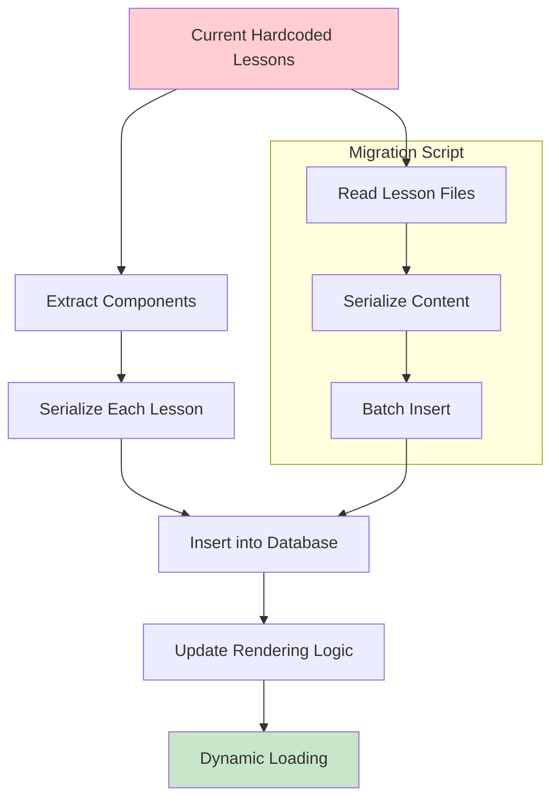

```typescript
// Migration script
import { allLessons } from "./lessons";
import { serializeContent } from "@/utils/contentSerializer";

async function migrateLessons() {
  for (const lesson of allLessons) {
    const json = serializeContent(lesson.content);

    await db.lessons.insert({
      id: lesson.id,
      title: lesson.title,
      subject: lesson.subject,
      grade: lesson.grade,
      content: json,
      created_at: new Date(),
    });

    console.log(`Migrated lesson: ${lesson.title}`);
  }
}

migrateLessons().then(() => {
  console.log("Migration completed!");
});
```

## Best Practices

### 1. Content Structure

```typescript
// ✅ Good - Clean component structure
const lesson = (
  <div>
    <DefinitionBox title="..." content={<InlineMath math="..." />} />
    <TipBox content="..." />
    <ExampleBox question="..." answer="..." />
  </div>
);

// ❌ Bad - Avoid complex nested functions
const badLesson = (
  <div>
    <CustomBox onClick={() => complexFunction()} />
    <ComponentWithRef ref={myRef} />
  </div>
);
```

### 2. Math Handling

```typescript
// ✅ Good - Math as strings
<InlineMath math="x^2 + y^2 = r^2" />
<BlockMath math="\begin{align} x &= a + bi \\ y &= c + di \end{align}" />

// ❌ Bad - Dynamic math generation
<InlineMath math={generateMathExpression()} />
```

### 3. Performance Optimization

```typescript
// ✅ Good - Memoize serialization
const serializedContent = useMemo(() => serializeContent(content), [content]);

// ✅ Good - Lazy loading
const LessonComponent = lazy(() => import(`./lessons/${lessonId}`));

// ✅ Good - Split large content
const part1 = serializeContent(<Part1 />);
const part2 = serializeContent(<Part2 />);
// Load parts on demand
```

### 4. Error Handling

```typescript
function SafeDeserializer({ json }: { json: string }) {
  try {
    const content = deserializeContent(json);
    return <div>{content}</div>;
  } catch (error) {
    console.error("Deserialization failed:", error);
    return (
      <div className="error">
        <p>Failed to load content</p>
        <details>
          <summary>Error details</summary>
          <pre>{error.message}</pre>
        </details>
      </div>
    );
  }
}
```

## Troubleshooting

### Common Issues

#### 1. KaTeX Not Rendering

```typescript
// ✅ Ensure KaTeX CSS is imported
import 'katex/dist/katex.min.css';

// ✅ Check math prop format
<InlineMath math="x^2" /> // Correct
<InlineMath math={x^2} /> // Wrong - missing quotes

// ✅ Verify math expressions
<InlineMath math="\frac{a}{b}" /> // Correct
<InlineMath math="\frac{a}{b" />   // Wrong - missing closing brace
```

#### 2. Component Not Deserializing

```typescript
// Check if component is registered
// In contentSerializer.tsx:
const CUSTOM_COMPONENTS = new Map([
  [YourCustomBox, "YourCustomBox"], // ✅ Add here
  // ...
]);

const componentMap = {
  YourCustomBox, // ✅ Add here too
  // ...
};
```

#### 3. Props Lost After Deserialization

```typescript
// ✅ Serializable props
const goodProps = {
  title: "String",
  count: 42,
  items: ["array", "of", "strings"],
  config: { option: "value" },
};

// ❌ Non-serializable props
const badProps = {
  onClick: () => {}, // Function
  ref: myRef, // Ref
  element: document.getElementById("id"), // DOM node
};
```

#### 4. Performance Issues

```typescript
// ✅ Optimize large content
const optimizedContent = useMemo(() => {
  return serializeContent(largeContent);
}, [largeContent]);

// ✅ Split content
const sections = content.map((section) => serializeContent(section));

// ✅ Cache deserialized content
const cachedContent = useMemo(() => deserializeContent(json), [json]);
```

### Debug Tools

```typescript
// Debug serialization
function debugSerialize(content: ReactNode) {
  console.log("Original content:", content);

  const serialized = serializeContent(content);
  console.log("Serialized JSON:", serialized);

  const deserialized = deserializeContent(serialized);
  console.log("Deserialized content:", deserialized);

  return { serialized, deserialized };
}

// Validate round-trip
function validateSerialization(content: ReactNode) {
  const serialized = serializeContent(content);
  const deserialized = deserializeContent(serialized);

  // Compare structure (simplified)
  const originalStr = JSON.stringify(content, null, 2);
  const deserializedStr = JSON.stringify(deserialized, null, 2);

  return originalStr === deserializedStr;
}
```

## Summary

The Content Serializer provides a complete solution for storing React components in databases:

### ✅ What Works Perfectly

- **All 17 Box Components** - DefinitionBox, TipBox, ExampleBox, etc.
- **KaTeX Math Rendering** - Both InlineMath and BlockMath
- **Complex Nested Content** - Any combination of components
- **Props Preservation** - All serializable props maintained
- **Database Integration** - Works with PostgreSQL, MongoDB, Supabase
- **Performance** - Fast serialization/deserialization
- **Type Safety** - Full TypeScript support

### ⚠️ Limitations

- **Functions** - Event handlers need to be reattached after deserialization
- **Refs** - DOM references are not preserved
- **Context** - React context values are not serialized

### 🚀 Benefits

- **Dynamic Content** - Load lessons from database
- **CMS Ready** - Edit content through admin interface
- **Scalable** - Handle thousands of lessons
- **Flexible** - Any component structure supported
- **Maintainable** - Clean separation of content and code

The serializer is production-ready and handles all your current box system requirements while being flexible enough for future enhancements.
