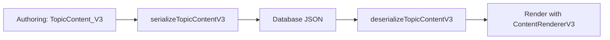
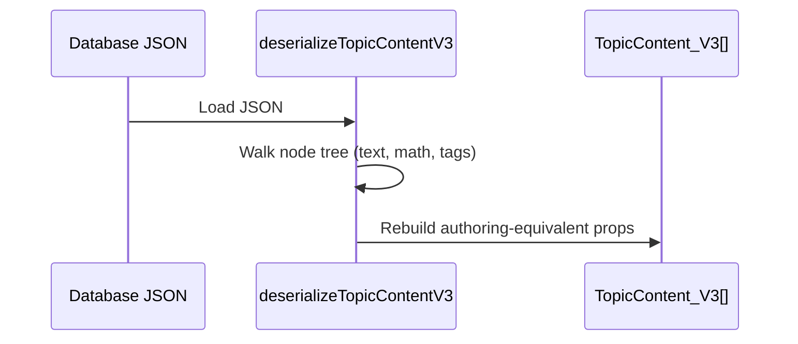
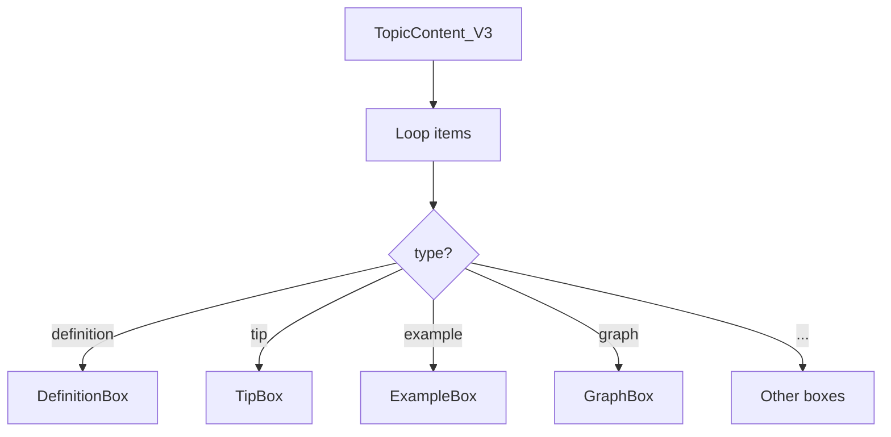

# Serializer V2 (TopicContent_V3) – Practical Guide

## What V2 Solves

V2 standardizes lesson content as an ordered array of typed items (TopicContent_V3[]). Each item declares its type (definition, tip, example, exercise, graph, threeD, imageExplanation, videoExplanation, graphExplanation, threeDExplanation) and its props. This allows:

- Clean authoring in TypeScript (including div/span and KaTeX in props)
- Safe serialization for database storage
- Accurate deserialization back to the original shape
- A simple renderer that maps types → box components

High-level flow:



## The TopicContent_V3 Type (Authoring Shape)

TopicContent_V3 is a discriminated union. A few examples (full union lives in `src/types/docs/topic.ts`):

- { type: "definition" } & DefinitionBoxProps
- { type: "tip" } & TipBoxProps
- { type: "example" } & ExampleBoxProps
- { type: "exercise" } & ExerciseBoxProps
- { type: "graph" } & GraphBoxProps
- { type: "threeD" } & ThreeDBoxProps
- { type: "imageExplanation" } & ImageBoxProps
- { type: "videoExplanation" } & VideoBoxProps
- { type: "graphExplanation" } & GraphExplanationBoxProps
- { type: "threeDExplanation" } & ThreeDExplanationBoxProps

Authoring supports ReactNode props (strings, div/span trees, and KaTeX). Example:

```tsx
const items: TopicContent_V3[] = [
  {
    type: "definition",
    title: "តើចំនួនកុំព្លិចជាអ្វី?",
    content: (
      <div>
        ចំនួនកុំផ្លិចមានរាង <InlineMath math="z = a + bi" />
      </div>
    ),
  },
  {
    type: "example",
    question: (
      <span>
        គណនា <InlineMath math="(2+3i) + (1-2i)" />
      </span>
    ),
    steps: [
      { title: "បូកផ្នែកពិត", content: <InlineMath math="2+1=3" /> },
      { title: "បូកផ្នែកនិមិត្ត", content: <InlineMath math="3i+(-2i)=i" /> },
    ],
    answer: <InlineMath math="3 + i" />,
  },
];
```

## Serialization – Turning Divs/Math into a JSON Node Tree

Function: `serializeTopicContentV3(items: TopicContent_V3[]): string`

What it does to every prop value (recursively):

- Text/number → `{ type: "text", value: "..." }`
- KaTeX → `{ type: "InlineMath"|"BlockMath", props: { math: "..." } }`
- HTML tags → `{ type: "div"|"span"|..., props: { children: [...] } }`
- Arrays/objects → walk recursively, converting any embedded React element to the JSON node form

Resulting JSON shape for the example above (abridged):

```json
[
  {
    "type": "definition",
    "props": {
      "title": "…",
      "content": {
        "type": "div",
        "props": {
          "children": [
            "ចំនួនកុំផ្លិចមានរាង ",
            { "type": "InlineMath", "props": { "math": "z = a + bi" } }
          ]
        }
      }
    }
  },
  {
    "type": "example",
    "props": {
      "question": {
        "type": "span",
        "props": {
          "children": [
            "គណនា ",
            { "type": "InlineMath", "props": { "math": "(2+3i) + (1-2i)" } }
          ]
        }
      },
      "steps": [
        {
          "title": "បូកផ្នែកពិត",
          "content": { "type": "InlineMath", "props": { "math": "2+1=3" } }
        },
        {
          "title": "បូកផ្នែកនិមិត្ត",
          "content": { "type": "InlineMath", "props": { "math": "3i+(-2i)=i" } }
        }
      ],
      "answer": { "type": "InlineMath", "props": { "math": "3 + i" } }
    }
  }
]
```

Why a node tree? It’s a lossless representation of your authoring (div/span structure, children order, and math content) that JSON/DBs can store reliably.

## Deserialization – Back to TopicContent_V3 with Divs/Math

Function: `deserializeTopicContentV3(json: string): TopicContent_V3[]`

What it does:

- Parses JSON
- For each `{ type, props }` entry, rebuilds props by converting node objects back to React elements:
  - `{ type: "text" }` → string
  - `{ type: "InlineMath"|"BlockMath" }` → <InlineMath|BlockMath math="…" />
  - `{ type: "div"|"span"|… }` → React.createElement(tag, …, children)
  - Arrays/objects → recursively revive nested nodes
- Returns a valid TopicContent_V3[] ready to render

Optional: `deserializeTopicContentV3ToTree(json)` returns a pure-JSON tree (no React elements) useful for debugging or non-React consumers.



## Rendering – ContentRendererV3

The renderer receives TopicContent_V3[] and iterates sequentially. For each entry:

1. Switch on `type`
2. Pick the corresponding box component (e.g., `type: "definition"` → <DefinitionBox …/>)
3. Pass props directly (including ReactNode props rebuilt by deserialization)
4. Render in document order



Because props are revived as ReactNodes, children such as `<div>… <InlineMath/> …</div>` render exactly as authored.

## End‑to‑End Example

```tsx
// 1) Authoring
const items: TopicContent_V3[] = [
  {
    type: "definition",
    title: "…",
    content: (
      <div>
        … <InlineMath math="x^2" />
      </div>
    ),
  },
  { type: "tip", title: "ចំណាំ", content: "Remember i^2 = -1" },
];

// 2) Serialize for DB
const json = serializeTopicContentV3(items);
await db.lessons.insert({ id: "lesson-1", content: json });

// 3) Fetch from DB and deserialize
const row = await db.lessons.findOne({ id: "lesson-1" });
const restored = deserializeTopicContentV3(row.content);

// 4) Render
return <ContentRendererV3 content={restored} />;
```

## Notes & Tips

- Keep math strings valid LaTeX; both InlineMath and BlockMath are supported.
- Props must be serializable (strings, numbers, arrays, objects). Functions/refs are not stored.
- For complex nested objects (e.g., `example.steps[]`), the serializer walks and converts any React element it finds.
- Use `deserializeTopicContentV3ToTree` to inspect the exact JSON node tree if debugging.

## Why V2 (vs V1)

- V1 was a free‑form React tree: flexible but difficult to validate/query.
- V2 is content‑model oriented (TopicContent_V3): easy to edit, store, query, and render consistently, while still preserving rich inline structures via the node tree.

That’s the full lifecycle: author → serialize → store → fetch → deserialize → render. The divs and math you write during authoring round‑trip losslessly through JSON and back to React.
